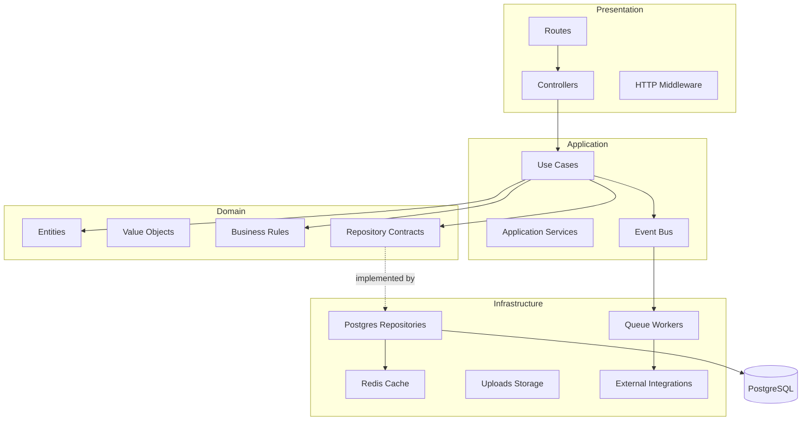
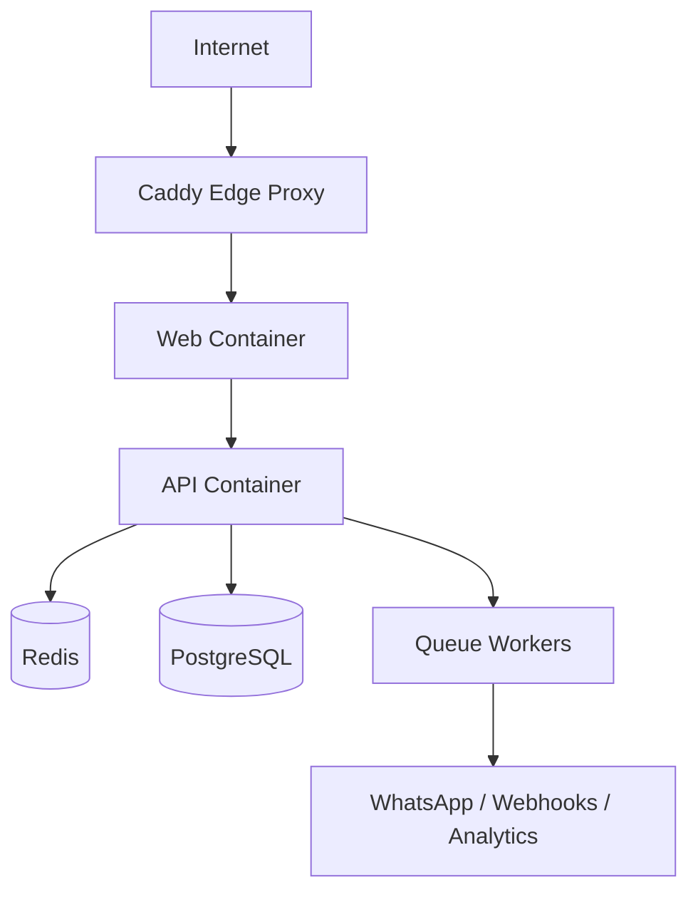

# خطة تحويل مشروع المتجر إلى بنية إنتاجية قوية

ملاحظة مهمة:

- هذا الملف أصبح مرجعًا تاريخيًا لخطة التحول الأصلية.
- الحالة التنفيذية الحالية المحدثة موجودة في [ARCHITECTURE_TRANSFORMATION_STATUS_AR.md](/root/express-trade-kit/docs/ARCHITECTURE_TRANSFORMATION_STATUS_AR.md).
- بعض الإشارات أدناه تصف الوضع السابق وقت وضع الخطة، وليست وصفًا حرفيًا للشجرة الحالية بعد اكتمال التحول.

هذا المستند محفوظ كمرجع أرشيفي لفهم المسار الذي قاد إلى البنية الحالية، وليس كخطة عمل نشطة الآن.

هذا الملف ليس تصورًا نظريًا عامًا، بل خطة عملية خاصة بالمشروع الحالي `Express Trade Kit` في لحظة إعدادها تاريخيًا.

الهدف هو الوصول إلى نظام:

- قوي في بيئة الإنتاج
- قابل للتوسع
- يتحمل عددًا كبيرًا من الطلبات يوميًا
- قابل للصيانة لسنوات
- سهل الإصلاح
- يسمح بتعديل أي جزء بأقل تأثير ممكن على الأجزاء الأخرى

## 1. المبدأ الأساسي

لن نعيد كتابة المشروع من الصفر.

سنحوّل المشروع الحالي تدريجيًا من:

```text
routes -> controllers -> db/utils
```

إلى:

```text
presentation -> application -> domain -> infrastructure
```

لكن مع شرط مهم جدًا:

**نحافظ على نموذج البيانات الحالي، وحالات الطلب الحالية، ومسارات API الحالية في المراحل الأولى.**

هذا يعني أن التحول سيكون `incremental refactor` وليس `big bang rewrite`.

## 2. ما الذي نحتفظ به من المشروع الحالي

هذه الأجزاء الحالية جيدة ويمكن البناء عليها:

- `Express API` الحالي
- `PostgreSQL` الحالي
- وجود تقسيم واضح للمسارات في طبقة HTTP
- وجود validators عبر `zod`
- وجود middleware للمصادقة والحماية
- وجود logging وhealth check
- وجود فصل نسبي بين routes وcontrollers
- وجود مسار نشر Docker متعدد العملاء

## 3. ما الذي نغيّره

الأجزاء التي يجب تحسينها:

- نقل منطق الأعمال من `controllers` إلى `use cases`
- إنشاء `domain layer` حقيقي للقواعد التجارية الأساسية
- فصل الوصول لقاعدة البيانات داخل `repositories`
- إضافة `service boundaries` واضحة
- إضافة `caching` للقراءات الثقيلة
- إضافة `event bus` داخلي
- إضافة `queue` للمهام البطيئة
- زيادة الاختبارات على مستوى الخادم
- تحسين التهيئة والإقلاع والإغلاق النظيف

## 4. المشاكل الحالية الفعلية في هذا المشروع

### 4.1 تداخل منطق HTTP مع منطق الأعمال

مثلًا في البنية القديمة كان ملف `ordersController` يحمل في نفس المكان:

- فحص المخزون
- إنشاء الطلب
- إدراج العناصر
- خصم المخزون
- حساب الإجمالي
- إرسال webhook
- إرسال إشعار الحالة

هذا يجعل `controller` مسؤولًا عن أكثر من شيء.

### 4.2 الاعتماد المباشر على قاعدة البيانات داخل controllers

في البنية القديمة كان يتم استخدام `pool.query(...)` مباشرة داخل controllers مثل `products` و`orders`.

النتيجة:

- صعوبة الاختبار
- صعوبة استبدال طريقة التخزين
- صعوبة عزل الأخطاء
- صعوبة إعادة استخدام المنطق خارج HTTP

### 4.3 بعض القواعد التجارية موجودة لكنها غير ممركزة

مثال ممتاز: خريطة انتقال حالات الطلب كانت موجودة فعلًا داخل controller بدل تمركزها في الدومين.

هذا جيد من حيث وجود القاعدة، لكنه يجب أن ينتقل إلى `domain` بدل بقائه داخل controller.

### 4.4 غياب طبقة caching

القراءات المهمة مثل:

- المنتجات
- الإعدادات
- الصفحات
- التصنيفات

تذهب مباشرة إلى PostgreSQL في كل مرة.

هذا ليس جيدًا عندما يزيد عدد الزوار والطلبات.

### 4.5 غياب queue للمهام البطيئة

مثل:

- إشعارات WhatsApp
- webhooks
- تحليلات Facebook CAPI
- معالجة الصور لاحقًا

هذه لا يجب أن تبطئ استجابة الطلب الأساسية.

### 4.6 تغطية اختبارية غير كافية للخادم

يوجد إعداد اختبار في الواجهة، لكن الخادم نفسه يحتاج:

- unit tests
- integration tests
- smoke tests للـ API

## 5. الشكل المستهدف المناسب لهذا المشروع



## 6. التكيف مع المشروع الحالي بدل كسره

### 6.1 حالات الطلب

لن نستبدل حالات الطلب الحالية.

الدومين الجديد يجب أن يبنى على الحالات الموجودة فعليًا في قاعدة البيانات:

- `new`
- `attempt`
- `no_answer`
- `confirmed`
- `cancelled`
- `ready`
- `shipped`
- `delivered`
- `returned`

وليس على حالات جديدة مثل `pending` أو `processing`.

### 6.2 نموذج المنتجات

لن نغيّر schema الحالي في البداية.

الدومين وrepositories يجب أن يحترموا الأعمدة الموجودة فعليًا:

- `compare_price`
- `cost_price`
- `status`
- `image_url`
- `custom_options`

وليس أعمدة غير موجودة حاليًا مثل:

- `compare_at_price`
- `track_stock`
- `is_active`

### 6.3 قاعدة البيانات

الخطوة الأولى ليست إعادة تصميم قاعدة البيانات.

الخطوة الأولى هي:

- عزل الوصول إليها
- كتابة migrations منظمة
- إضافة indexes حيث يلزم
- تحسين الاستعلامات الثقيلة

## 7. الهيكل الجديد المقترح للخادم

```text
server/
├── src/
│   ├── index.js
│   ├── app.js
│   ├── container.js
│   ├── config/
│   ├── presentation/
│   │   ├── routes/
│   │   ├── controllers/
│   │   ├── middleware/
│   │   └── validators/
│   ├── application/
│   │   ├── use-cases/
│   │   ├── services/
│   │   └── event-handlers/
│   ├── domain/
│   │   ├── entities/
│   │   ├── value-objects/
│   │   ├── rules/
│   │   ├── errors/
│   │   └── repositories/
│   ├── infrastructure/
│   │   ├── repositories/
│   │   ├── cache/
│   │   ├── queue/
│   │   ├── storage/
│   │   └── external/
│   └── shared/
│       ├── utils/
│       └── constants/
└── tests/
```

## 8. ما الذي ندخله في Domain فعلاً

طبقة `domain` هنا يجب أن تكون صغيرة ومركزة، لا ضخمة.

### 8.1 Value Objects

المناسب جدًا لهذا المشروع:

- `Money`
- `Phone`
- `OrderStatus`
- `Slug`

### 8.2 Entities

الأولوية:

- `Order`
- `Product`
- `Customer`

بعدها:

- `Category`
- `Page`
- `Cart`

### 8.3 Business Rules

أمثلة للقواعد التي يجب نقلها إلى الدومين:

- انتقالات حالات الطلب
- صلاحية خصم المخزون
- حساب subtotal / total
- التحقق من القيم السالبة
- التحقق من بنية خيارات المنتج
- قواعد تفعيل / تعطيل المنتج

## 9. ما الذي ندخله في Application Layer

طبقة `application` هي التي تنسق الخطوات بين الدومين والبنية التحتية.

أول use cases يجب إنشاؤها:

- `CreateOrder`
- `UpdateOrderStatus`
- `ListOrders`
- `CreateProduct`
- `UpdateProduct`
- `ListProducts`
- `GetStoreSettings`
- `UpdateStoreSettings`

### مثال عملي من المشروع الحالي

بدل أن يبقى إنشاء الطلب داخل controller فقط، يصبح:

1. الـ route يستقبل الطلب
2. الـ controller يحوله إلى use case
3. الـ use case:
   - يجلب المنتجات
   - يتحقق من المخزون
   - يحسب المجاميع
   - ينشئ الطلب
   - يخصم المخزون
   - ينشر event
4. الـ controller يعيد response فقط

## 10. ما الذي ندخله في Infrastructure

### 10.1 Repositories

نبدأ بإنشاء repositories حقيقية لـ:

- `ProductRepository`
- `OrderRepository`
- `CustomerRepository`
- `CategoryRepository`
- `SettingsRepository`

كل repository يجب أن يلف `pool.query` بدل استخدامه مباشرة من controller.

### 10.2 Cache

نضيف Redis لكن بطريقة `optional-first`.

يعني:

- في التطوير: يعمل النظام بدون Redis
- في الإنتاج: يستخدم Redis للكاش

المرشح الأول للكاش:

- `GET /api/products`
- `GET /api/categories`
- `GET /api/pages`
- `GET /api/settings`

### 10.3 Queue

نضيف queue للعمليات غير الحرجة زمنيًا:

- WhatsApp notifications
- order webhooks
- analytics events
- image processing

### 10.4 Storage

يبقى `local uploads` أولًا كما هو.

لكن ننشئ abstraction من الآن:

- `LocalStorage`
- مستقبلًا `S3Storage`

حتى لا يرتبط التطبيق مباشرة بمجلد uploads.

## 11. ما الذي لا يجب فعله الآن

هذه أشياء جيدة نظريًا لكنها غير مناسبة كمرحلة أولى:

- إعادة تسمية كل ملفات المشروع دفعة واحدة
- تغيير schema الحالي بالكامل
- استبدال كل controllers مرة واحدة
- بناء domain ضخم جدًا قبل أول refactor
- إدخال Redis وQueue وWorkers قبل عزل منطق الأعمال
- كسر واجهات API الحالية

## 12. الخطة المرحلية الواقعية

## المرحلة 1: إعادة تنظيم نقطة التشغيل

الهدف:

- فصل `app.js` عن `index.js`
- تجهيز `container.js`
- تنظيم config

النتيجة:

- إقلاع أنظف
- قابلية أفضل للاختبار
- تمهيد جيد للمراحل اللاحقة

## المرحلة 2: استخراج أول Domain حقيقي

الهدف:

- إنشاء `OrderStatus`
- إنشاء `Money`
- إنشاء `Order` بحد أدنى
- نقل `ORDER_STATUS_FLOW` من controller إلى domain

النتيجة:

- أهم قاعدة تجارية تصبح ممركزة
- تقليل مخاطر تعديل حالات الطلب

## المرحلة 3: أول Use Cases

الهدف:

- `CreateOrder`
- `UpdateOrderStatus`
- `ListProducts`

النتيجة:

- فصل business logic عن HTTP
- القدرة على اختبار المنطق بدون Express

## المرحلة 4: Repositories

الهدف:

- استبدال الاستعلامات المباشرة داخل controllers تدريجيًا
- إدخال `PgOrderRepository`
- إدخال `PgProductRepository`

النتيجة:

- عزل الوصول لقاعدة البيانات
- تسهيل الاختبارات

## المرحلة 5: Event Bus داخلي

الهدف:

- عند إنشاء طلب أو تغيير حالته، ننشر event

الأحداث الأولى:

- `order.created`
- `order.status_changed`

النتيجة:

- تقليل التشابك
- فصل الإشعارات والتحليلات عن منطق الطلب الأساسي

## المرحلة 6: Redis Cache

الهدف:

- إضافة `CacheService`
- ربطه بالقراءات الثقيلة

النتيجة:

- تقليل الضغط على PostgreSQL
- تحسين السرعة في الواجهة والمتجر

## المرحلة 7: Queue للمهام البطيئة

الهدف:

- نقل webhook / notifications / analytics إلى workers

النتيجة:

- response أسرع
- استقرار أعلى تحت الضغط

## المرحلة 8: الاختبارات والـ CI

الهدف:

- unit tests للدومين
- integration tests للـ repositories
- smoke tests للـ API

النتيجة:

- ثقة أعلى
- تقليل الأعطال الناتجة عن التعديلات

## 13. ترتيب الأولويات حسب العائد

إذا أردنا أعلى عائد بأقل مخاطرة، فالترتيب الأفضل هو:

1. `app.js + container.js + config cleanup`
2. `Order domain + CreateOrder use case`
3. `OrderRepository + ProductRepository`
4. `event bus`
5. `tests`
6. `redis cache`
7. `queue workers`

## 14. بنية النشر المستهدفة بعد التحسين

البنية الحالية جيدة من حيث فصل:

- `web`
- `api`
- `db`

لكن في النسخة الأقوى إنتاجيًا يفضل أن تصبح:



### الحد الأدنى الموصى به للإنتاج

- `PostgreSQL`
- `API`
- `Web`
- `Redis`

### المستوى الأعلى بعد ذلك

- Workers مستقلة
- مراقبة وتنبيهات
- structured logging
- backup strategy أوضح

## 15. ما الذي سيمنحنا الصمود لسنوات

الأشياء الأكثر أهمية فعلًا للصمود الطويل:

- boundaries واضحة بين الطبقات
- business rules داخل domain وليس داخل controllers
- repository abstraction
- migrations منظمة
- tests على المسارات الحرجة
- caching مضبوط
- queue للعمليات الثانوية
- health checks أقوى
- graceful shutdown

## 16. النتيجة النهائية المستهدفة

عند اكتمال هذا التحول، يصبح المشروع:

- أسرع تحت الضغط
- أقل هشاشة عند التعديل
- أسهل في الصيانة
- أوضح للانضمام من مطورين جدد
- أكثر ثقة في بيئة الإنتاج
- جاهزًا للنمو لعدة متاجر وعدة سنوات

## 17. القرار الهندسي الأهم

التحول الصحيح لهذا المشروع ليس:

**إعادة اختراع النظام**

بل:

**استخراج الحدود الصحيحة من داخل النظام الحالي، ثم تقويتها تدريجيًا**

وهذا هو المسار الأنسب للوصول إلى:

- بنية قوية
- توسع آمن
- أداء أفضل
- قابلية صيانة عالية

بدون كسر الإنتاج أو الدخول في إعادة كتابة خطرة.
